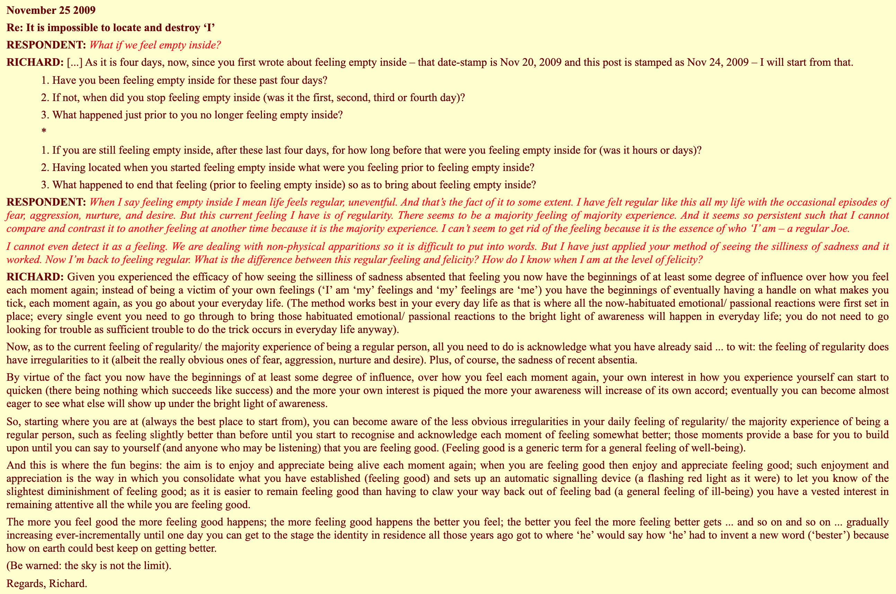

# Actualism HOWTO

Algorithmically, the actualism method – [the ongoing enjoyment and appreciation of this moment of being alive](http://www.actualfreedom.com.au/richard/abditorium/method.htm#The%20Actualism%20Method) – can be described as follows:

- Develop an unwavering sincere ([[[8184b1bc]]]) intent to progress in actualism (consistent [[[426d55fc]]]). 
  - This should trump every other "priority" of yours. You are obsessed with success in actualism over anything else[^aff]. What this means is that your no. 1 priority will be to enjoy and appreciate each and every moment. In short, [[[131c8131]]].
  - Obsession cannot forced. You also need to [[[0f896f5f]]], along with initial success in the method snowballing (see screenshot further below), for it to become effortless ([[[7857b534]]]).
  - Above all, your intent needs to be sincere; it is [[[8184b1bc]]] that unlocks [[[6e564791]]].
- Experientially realize that it is my **choice** as to how I feel right now: <974ce006>
- Stay **affectively aware** (24/7[^aff]) of how I am experiencing this moment (the only moment) of being alive
- Once I find myself no longer feeling good, stop whatever is it I'm doing, and engage cognitive attention[^aff] to **trace back to the exact trigger** that *caused* that feeling. 
  - As well as <aab870e2>
- Seeing the **silliness** of having such an incident puts me back on track (i.e., I resume feeling good).
- Make a mental note of the trigger such that in future if a similar kind of incident is to occur, I can decline going down this path by **nipping it in the bud**

[^aff]: Note that this does *not* mean that you must renunciate your everyday activities, which you can do at the same time as practicing actualism. See [[[42586bf9]]].

Here's how the method is officially described:

> RICHARD: Once the specific moment of ceasing to feel good is pin-pointed, and the silliness  of having such an incident as that (no matter what it is) take away one’s enjoyment and appreciation of this only moment of being alive is seen for what it is – usually some habitual reactive response – one is once more feeling good ... but with a pin-pointed cue to watch out for next time so as to not have that trigger off yet another bout of the same-old same-old. This is called nipping it in the bud before it gets out of hand ... with application and diligence and patience and perseverance one soon gets the knack of this and more and more time is spent enjoying and appreciating this moment of being alive. And, of course, once one does get the knack of this, one up-levels ‘feeling good’, as a bottom line each moment again, to ‘feeling happy and harmless’ ... and after that to ‘feeling perfect’. --[This Moment Of Being Alive](http://www.actualfreedom.com.au/richard/articles/thismomentofbeingalive.htm)

And here's how it is described in a more verbose manner to someone who appears somewhat depressed and is struggling to practice it:

<http://www.actualfreedom.com.au/richard/listdcorrespondence/listd11.htm>

