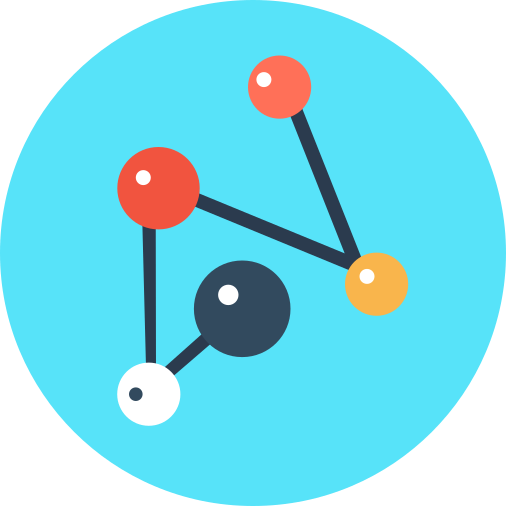

# Cerveau: a future-proof web app for notes

{.ui .red .inverted .centered .message}
Work in progress draft. DO NOT LINK PUBLICLY.

I'd like to announce the public beta of [Cerveau][cerveau][^pronounce], a web app for managing plain-text notes from a GitHub repository. Cerveau integrates directly with [[b6df4059]] which supports [Zettelkasten](https://writingcooperative.com/zettelkasten-how-one-german-scholar-was-so-freakishly-productive-997e4e0ca125)-style note-taking in Markdown. This very site you are reading is managed by Neuron and edited in Cerveau.

[^pronounce]: "Cerveau" is prounced with the "eau" sounding like the "o" in "Go". See [audio playback](https://en.wiktionary.org/wiki/cerveau#Pronunciation).

[{.ui .centered .tiny .image}][cerveau]

## Motivation

I created the open-source [[b6df4059]] to [scratch my own itch](https://en.wiktionary.org/wiki/scratch_one%27s_own_itch), wherein I wanted to maintain my notes for a lifetime, without being dependent on proprietory formats or systems. I still wasn't totally satisfied however, because I did not want to give up on the *convenience* of managing notes from a web app on my mobile phone. I didn't want to be tied to a desktop text editor. So, the idea behind Cerveau was born - which began to resolve that dissatifaction without compromising on [future-proofness][future-proof].

## How does it work?

All notes are written in Markdown, and stored in a Git repository. Cerveau directly modifies the contents of the repository using [GitHub Apps API](https://docs.github.com/en/developers/apps), while caching the latest revision of the repository on a PostgreSQL database. This allows me to edit my notes from a web browser (as well as from a mobile phone), while keeping the canonical version always on Git all the while allowing edits from elsewhere such as [Emacs](https://github.com/felko/neuron-mode#neuron-mode) (i.e., two-way sync).

## Technology used

Both the backend and frontend components of Cerveau are written in [[2009703]]. Haskell is my programming language of choice, because it gets a lot of things right (see [Why Haskell matters](https://wiki.haskell.org/Why_Haskell_matters)). Software I write in Haskell tends to be reliable; and I can refactor with confidence without being afraid of introducing bugs. This is especially important when dealing with otherwise brittle JavaScript code in frontend code.

### JavaScript is the new assembly language

Cerveau's frontend too is written in Haskell. Wait, how is that possible? The GHCJS compiler compiles Haskell code to low-level JavaScript for running in the browser. Cerveau uses the [[2012405]] library, via the excellent [[2012403]] framework, which takes care of all the plumbing required to produce such full-stack Haskell apps, so that I as a developer can focus on the FRP application logic. FRP, and similar models of UI programming, is simpler to write and extend than callback based code. Anybody who writes Elm can attest to that; however unlike Elm or PureScript, GHCJS code can be *shared* with the backend. This is what enables Cerveau to directly reuse much of the [[b6df4059]] source code, thus enabling neuron's core features to work directly on the browser--for example, live HTML preview while editing the note.

{.ui .basic .segment .centered .grid}
<video autoplay muted loop width="100%">
  <source src="/static/cerveau-live-preview.webm" type="video/webm">
</video>

The editor widget is based on CodeMirror, via [reflex-codemirror](https://github.com/Atidot/reflex-codemirror).

### Real-time communication via WebSockets

WebSockets, via [[2012401]], is used for real-time communication between the backend and the frontend; if you have two windows open, then updating a note from one window will have the other window automatically update its view without an explicit refresh (this works even if you are viewing a different note that has the modified note in its backlinks). 

### Nix

[[2017102]] is used for both developent and deployment; the production version in particular is deployed to a [DigitalOcean](https://m.do.co/c/d19bbb4d33e8) droplet running [[c7170724]]. Nix makes reproducible development environments easy and possible. A testament to this is how easy it is to contribute to neuron (see [CONTRIBUTING.md](https://github.com/srid/neuron/blob/master/CONTRIBUTING.md)) - as with one command, `nix-shell`, you get the full development enviornment including Haskell IDE support starting from a pristine system with nothing but Nix installed.

### Full-Stack Haskell, from Prototype to Production

Much of these technology choices were informed by my working with the folks from [Obsidian Systems](https://obsidian.systems), whose philosophy is captured in [this talk](https://www.youtube.com/watch?v=riJuXDIUMA0).

{.ui .basic .segment .centered .grid}
<iframe width="560" height="315" src="https://www.youtube.com/embed/riJuXDIUMA0" frameborder="0" allow="accelerometer; autoplay; encrypted-media; gyroscope; picture-in-picture" allowfullscreen></iframe>

## Towards perfecting [future-proof] note-taking

Making [future-proof][future-proof] note-taking awesome is my current goal. [LSP support](https://github.com/srid/neuron/issues/213), which facilitates improved note-taking experience in modern editors like VSCode, for Neuron is just one of the several things we can do to move towards that goal.

Where does Cerveau fit in all of this? Cerveau is a "luxury on top", and a gift to those who help [sponsor the open-source Neuron][sponsor] project to realize the aforementioned goal. 

[www.cerveau.app][cerveau] offers a Free account (limited notes) for anybody to try, as well as a Pro account (unlimited notes) for [GitHub sponsors][sponsor] on the "Cerveau Pro Plan" tier or above.

**Will Cerveau be open-sourced?** Although nothing concrete has come up yet, I'm entertaining the idea of eventually open-sourcing Cerveau after getting [N number of sponsors](https://twitter.com/availablegreen/status/1291162883125137408). But, all of this is very much dependent on the sponsorship interest in Neuron/Cerveau over the coming months.

## What's next?

User-level roadmap for Cerveau is [tracked here](https://github.com/srid/cerveau-issues/issues). Two major features I'd like to see done myself next are:

* **Auto-completion of links**: typing `[[` in the CodeMirror text editor should bring up an autocomplete popup of note titles.
* **Auto-save**: auto-save notes while editing, to provide a Google Docs like feel.

:::{.ui .message .segment}
Special thanks goes to the recent [sponsors][sponsor], including
 [Henri Maurer](https://github.com/hmaurer),
 [Peter Iannone](https://github.com/piannone), 
 [zimbatm](https://github.com/zimbatm),
 [Saif Elokour](https://github.com/saifelokour),
 [Alexander Thaller](https://github.com/AlexanderThaller),
 [Rafael](https://github.com/netstx),
 [Cody Goodman](https://github.com/codygman),
 [Artyom Kazak](https://github.com/neongreen) and
 [Abhas Abhinav](https://github.com/abhas).

💖
:::

[cerveau]: https://www.cerveau.app
[sponsor]: https://github.com/sponsors/srid
[future-proof]: https://neuron.zettel.page/6f0f0bcc.html
