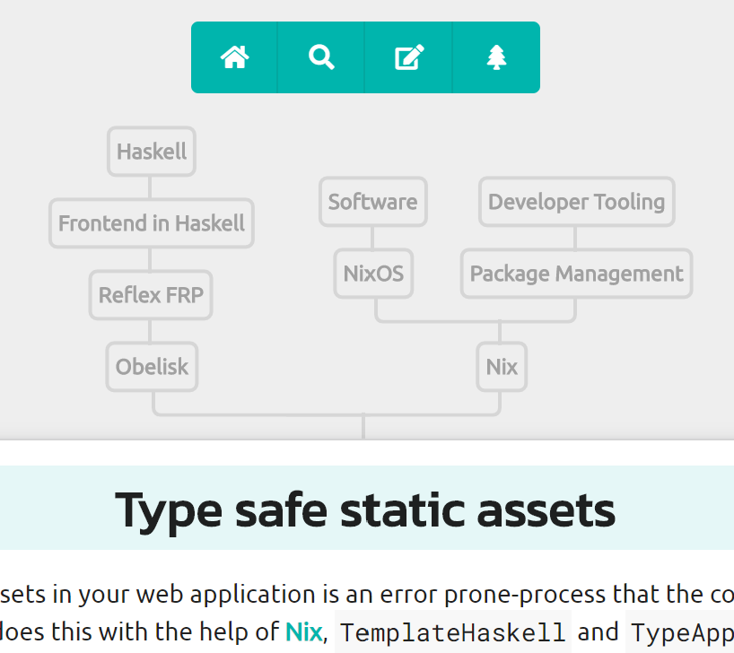
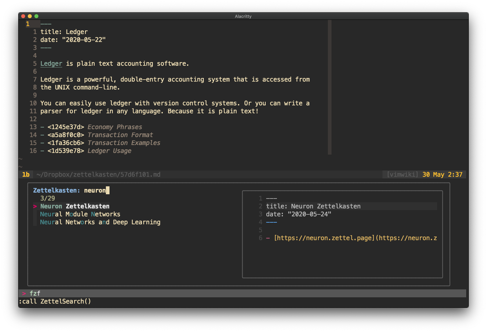

# Neuron 0.6 released

{.ui .warning .message}
Work in progress. Please do not share.

<b6df4059?cf> ([GitHub repo](https://github.com/srid/neuron)) is a note-taking tool based on [Zettelkasten](https://neuron.zettel.page/2011401.html), that aims to be future-proof. Version [0.6](https://github.com/srid/neuron/releases/tag/0.6.0.0) just got released; its major highlight is that neuron is now based on the **Pandoc** AST. This allows us to support any format supported by [Pandoc](https://pandoc.org/). Experimental **org-mode** support is already in to begin with.

## Better Markdown

Previous versions of neuron used the [mmark](https://hackage.haskell.org/package/mmark) parser which advertises itself as being "strict". This prevented certain links from working as they caused the parser to fail. In version 0.6, I switched over to use [commonmark-hs](https://github.com/jgm/commonmark-hs), which is the Haskell implementation of the [**CommonMark** specification](https://commonmark.org/), written by the same author of Pandoc. Another reason for switching is that commonmark-hs and its extensions can be compiled to JavaScript via GHCJS[^ob], which is useful when reusing the Haskell code with the web app (see below).

[^ob]: See <fa9766e6?cf> for a description of the development workflow involving writing Haskell on the frontend.

The commonmark-hs parser includes [a bunch of nifty **extensions**](https://github.com/jgm/commonmark-hs/tree/master/commonmark-extensions) that are all made available in neuron. 

In addition, you can style your Markdown notes using supported Semantic UI classes ([see here](https://github.com/srid/neuron/issues/176)), as well as use raw HTML if necessary.

## Uplink Tree

I find arbitrary graph views of Zettelkasten software to be rarely useful. Neuron on the other hand displays what is known as a "[uplink tree](https://neuron.zettel.page/5e41fd32.html)" in each note view, which represents the *subset* (inasmuch as an "uplink" is a type of a "backlink") of the backlink graph for that note. In Zettelkasten-speak, we talk of a note "branching" to another. The uplink tree displays all notes "branching" to the note being viewed. 

Uplink Trees are similar to nagivation panel or category tree, except that the heterarchy is built organically over time based on how the notes are linked (see [Folgezettel Heterarchy](https://neuron.zettel.page/2017401.html)). In the screenshot below, you are viewing the uplink tree of the note titled "<2017101?cf>". Notice how this note has multiple parents (that "branch of" to that note). See [Linking](https://neuron.zettel.page/2011504.html) in the neuron manual.

{.ui .centered .large .image}

## Vim

In addition to [Emacs](https://neuron.zettel.page/4a6b25f1.html), there is now a Vim extension for neuron. See [neuron.vim](https://github.com/ihsanturk/neuron.vim) by ihsan. Just like the Emaccs extension, it supports "virtual titles" in neovim, where the title of a linked note is displayed next to the link ID, as you can see from the screenshot below.

{.ui .centered .huge .image}

## Improved CLI query

The `neuron query` command can be used to query your Zettelkasten and get JSON output. `neuron query --id <ID>` gets you the metadata of a zettel note, whereas `neuron query --graph` gets the entire graph. For an example of what you can do with the later, checkout [neuron-autoindex](https://github.com/b0o/neuron-extras) by Maddison Hellstrom.

## Error reporting

Neuron 0.6 includes resilient error handling. If there is any error in your notes, the command line tool will report them both in the console and the web interface, without breaking its workflow.

## Docker images

While Nix is still the recommended way to install, we now also have auto-created Docker images for neuron. With one `docker run ...` command, you can run the latest development version of `neuron` in a matter of seconds. The whole image is only about 100MB in size. See [Docker workflow](https://neuron.zettel.page/c6176636.html) for details.

## Automatic Publishing

You can now setup your neuron notes to publish *automatically* on the web. See [neuron-template](https://github.com/srid/neuron-template#readme) to get started. The gist of the idea is that we use GitHub Actions and Pages to update your published site as you change your notes in the Git repository. I publish every neuron site in ths way. A [GitLab workflow](https://neuron.zettel.page/778816d3.html) also exists.

You can also of course alternatively choose to self-host your neuron site, say as a systemd service. See the [documentation on this](https://neuron.zettel.page/6479cd5e.html).

## Web & mobile app

[Cerveau](http://www.cerveau.app/) is the web application on top of neuron that integrates with GitHub. The idea is that you can have your cake and eat it too. A command-line based workflow to edit your notes in Git repo does not mean you can't do the same in a web application or a mobile app. Cerveau aims to address this gap, with the motto being: future-proof notes with little compromise on a delightful user experience.

:::{.ui .message .segment}
Special thanks goes to the project sponsors, including: [Adam Bowen](https://github.com/adamnbowen), [Alex Soto](https://github.com/alex-a-soto), [Gustav](https://github.com/Whil-), [Michel Kuhlmann](https://github.com/michelk) and [Ryan](https://github.com/digilypse). 

If enjoy using neuron, please considering sponsoring the project on GitHub.

<iframe src="https://github.com/sponsors/srid/card" title="Sponsor srid" height="225" width="600" style="border: 0;"></iframe>

:::