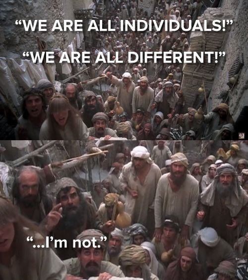

# Covert Social Conservatism

Geeks, or more specifically hackers[^def], used to treat their craft as a source of meaning[^ikigai], going contrary to the normative values likes "sex, money, and social approval"[^sex]. In modern times, where "tech" provides financially stable careers to plenty, this dynamic has somewhat reversed among a growing group of people. It has become fashionable to undermine one's geek interests, so as to normalize what's already "normal" outside tech - by, for example, belaboring the importance of the social instituitions[^clarify] of love, family, children.

[^def]: 
    **hacker: n.** An expert or enthusiast of any kind. One might be an astronomy hacker, for example. --[The Jargon File](http://www.catb.org/jargon/html/H/hacker.html)

[^ikigai]: Or more generally, as their [*ikigai*](https://savvytokyo.com/ikigai-japanese-concept-finding-purpose-life/).

[^sex]:
    > If you aren't the kind of person that feels this way [a basic thrill from solving problems, sharpening your skills, and exercising your intelligence] naturally, you'll need to become one in order to make it as a hacker. Otherwise you'll find your hacking energy is sapped by distractions like sex, money, and social approval. --[How To Become A Hacker](http://www.catb.org/esr/faqs/hacker-howto.html#believe1)

[^clarify]: Here, we are referring only to the whole (brainwashed) social identity formed around the otherwise carefree and idiosyncratic acts like raising children or sharing roof with fellow human beings.

Why the [desire to normalize](https://www.youtube.com/watch?v=QereR0CViMY) at all? Does it not go against the much touted, but rarely followed, value of "diversity"?

{.ui .centered .medium .image}

## Instances

Some examples:

* On what "actually matters" in life ("_I think relationships matter more than anything else._"): <https://twitter.com/sjsyrek/status/1276848455705604096>

## Underlying Psychology

* The human "need"[^need] to belong
* The strong desire for love, and to be loved
* The believed inability to break free of these bonds
* The lack of freedom to do the things one would want to do in life, if it not for the instinctual constraints
* The rationalization of one's bondage by downplaying anyone who lives more freely

## See also

* <5cde9fd6?cf>

[^need]: It is of course more accurate to describe this as a "desire" than a "need". The need to belong is unlike say the need for air and water; as you can live without the former (happily in fact).
